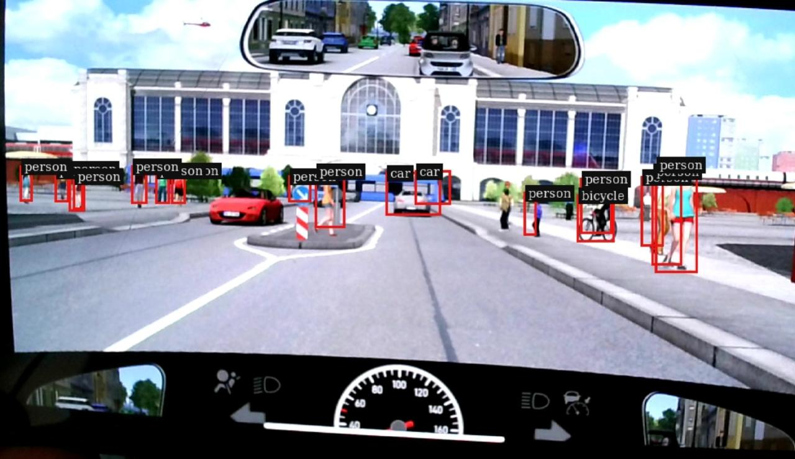

## Introduction.

The purpose, introduction, functional requirements, and non‑functional requirements of this project are described in the following document:

[System & Software Requirements Specification](./doc/sys_software_requirement_spec.md)

## Configure the build directory
- Always build out-of-source:
    cd adso_nvmm
    mkdir build
    cd build

## Run CMake

    cmake ..

## Build the executable

    make -j$(nproc)

## Run the pipeline

Example :
    ./jetson_gst_pipeline --nvmm
    ./jetson_gst_pipeline --cuda_process
    ./jetson_gst_pipeline --cuda_acc    
    ./jetson_gst_pipeline --infer
    ./jetson_gst_pipeline --headless

## Check Jetpack version in Jetson Orin

    dpkg -l | grep -i jetpack
    ii  nvidia-jetpack                               6.0+b106                                    arm64        NVIDIA Jetpack Meta Package
    ii  nvidia-jetpack-dev                           6.0+b106                                    arm64        NVIDIA Jetpack dev Meta Package
    ii  nvidia-jetpack-runtime                       6.0+b106                                    arm64        NVIDIA Jetpack runtime Meta Package

## Install DeepStream SDK (Jetson version)

 - Download the .deb package (Go to NVIDIA’s DeepStream Jetson download page (JetPack‑matched version))
 - For DeepStream 7.0 (JetPack 6.x), download:
     deepstream-7.0_7.0.0-1_arm64.deb

###  Install dependencies (if needed)

sudo apt install libgstreamer1.0-dev \
                 libgstreamer-plugins-base1.0-dev \
                 gstreamer1.0-tools \
                 gstreamer1.0-plugins-good \
                 gstreamer1.0-plugins-bad \
                 gstreamer1.0-plugins-ugly \
                 gstreamer1.0-libav
### Install DeepStream

    sudo dpkg -i deepstream-7.0_7.0.0-1_arm64.deb

## Test Output.

## Input Image  

## Output Image 

